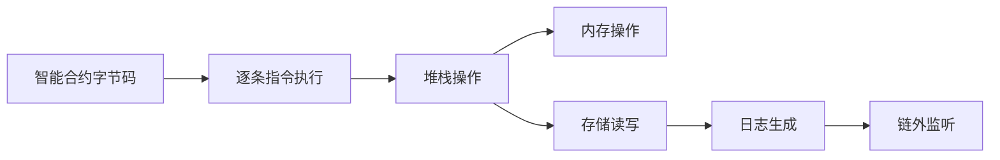

## 一、阐述Geth在以太坊生态中的定位

|        维度        | 角色与价值                                                   |
| :----------------: | ------------------------------------------------------------ |
|   **核心客户端**   | 官方 Go 语言实现，占据 >70% 节点份额，被视为协议“参考实现”。 |
|    **网络基石**    | 提供全节点/轻节点模式，负责区块验证、交易广播、状态存储，是以太坊去中心化架构的底层支撑。 |
|   **升级风向标**   | 历次硬分叉（伦敦、合并、上海）率先在 Geth 落地，其代码路径成为其他客户端兼容的“事实标准”。 |
|   **开发者入口**   | 内置 JSON-RPC、WebSocket、IPC 等多接口，配套 `clef` 签名、`geth attach` 控制台，降低 DApp、钱包、交易所集成门槛。 |
|   **企业级方案**   | 支持私有链/联盟链（Clique PoA）、许可网络、分层存储（Freezer）、动态快照，满足金融、供应链等场景合规需求。 |
| **生态多样性锚点** | 与 Nethermind（C#）、Besu（Java）、Erigon（Rust）等客户端共同构成多实现矩阵，防止单点故障，提升网络韧性。 |
|   **创新试验场**   | 早期集成 EIP-1559、Verkle Tree、PBS（Proposer-Builder Separation）等提案，为协议演进提供实测数据与反馈回路。 |

Geth 不只是“以太坊的 Go 实现”，它是整个生态的**默认网关**——从协议规范、网络运行到开发者工具链，几乎每一条路径都以其为起点或参照。

## 二、核心模块交互关系解析


### 2.1 区块链同步协议（eth/62, eth/63）

Geth 使用 `eth` 协议进行节点间通信，当前主流版本为 **eth/63**，兼容 eth/62。这两个协议版本是以太坊节点实现数据同步的核心规范，直接影响区块链数据传播效率和网络一致性。

| 协议版本 | 核心改进                                         | 数据传输方式                                  | 适用场景                      |
| -------- | ------------------------------------------------ | --------------------------------------------- | ----------------------------- |
| eth/62   | 区块头与区块体分离传输 基础状态同步支持          | 区块头批量请求+区块体按需下载                 | 全节点初始同步                |
| eth/63   | 新增交易收据批量同步 状态证明优化 请求优先级控制 | 区块头+区块体+收据并行传输 递归默克尔证明验证 | 轻节点状态查询 全节点增量同步 |

#### 同步核心流程：

1. **节点发现与握手**：通过 Kademlia 协议发现节点，完成 `eth` 协议版本协商
2. **区块头同步**：调用 `GetBlockHeaders` 批量获取区块头，验证链式结构完整性
3. **区块体同步**：通过 `GetBlockBodies` 请求缺失区块的交易列表
4. **收据同步**（eth/63）：使用 `GetReceipts` 获取交易执行结果，验证状态变更
5. **状态同步**：通过默克尔证明验证账户状态，全节点存储完整状态，轻节点仅缓存查询结果
6. **数据校验**：验证区块签名、交易合法性后写入数据库

### 2.2 交易池管理与 Gas 机制

在 `geth` 中，交易池（`txpool`）和 Gas 机制是两个密切相关的核心模块，它们共同作用于以太坊节点的交易验证与处理。以下是它们之间的交互关系解析。

####  交易池管理（`txpool`）

`txpool` 是一个临时存储待处理交易的模块，它的作用是接收、排序和管理尚未被打包进区块的交易。每个交易都会进入 `txpool`，直到矿工选择将其包含在下一个区块中。

#### 功能与作用

- **接收交易**：当节点收到新的交易时，它会首先验证交易的合法性（如签名有效性、账户余额等），然后将其存储在交易池中。
- **排序与筛选**：`txpool` 会根据 Gas 价格、交易的优先级以及其他条件（如账户状态等）对交易进行排序。通常，Gas 价格较高的交易会被优先处理。
- **交易的生命周期**：一旦交易通过验证并成功进入 `txpool`，它将在其中等待矿工选择，并最终被打包进区块。

#### Gas 机制

Gas 机制用于衡量交易或智能合约操作的计算成本。在以太坊中，执行每个操作都会消耗一定量的 Gas，交易发起人必须支付足够的 Gas 才能执行交易。

#### 功能与作用

- **Gas 消耗**：每个以太坊操作（如交易、智能合约执行）都会消耗一定数量的 Gas。EVM（以太坊虚拟机）会根据操作的复杂度来计算 Gas 消耗。
- **Gas 限制**：每个交易都会设定一个 Gas 限制，限制了该交易最多能消耗的 Gas 数量。如果交易超过这个限制，执行会被撤销。
- **Gas 价格**：Gas 价格是矿工愿意接受的 Gas 费用，它决定了交易被矿工优先打包的机会。高 Gas 价格的交易通常会被优先选择。

#### Gas 机制核心参数：

| 参数       | 作用                              | 决策主体                           |
| ---------- | --------------------------------- | ---------------------------------- |
| `GasLimit` | 单个交易中允许执行的最大 Gas 数量 | 交易发送者                         |
| `GasPrice` | 每单位 Gas 的费用（Wei）          | 交易发送者（PoW）/ 系统建议（PoS） |
| `BaseFee`  | 网络基础手续费（EIP-1559）        | 协议自动调整                       |
| `GasFee`   | 用户为某个交易所支付的费用总额    | GasLimit与 GasPrice的乘积          |

#### 交互关系

交易池和 Gas 机制在 `geth` 中有着密切的交互关系，具体表现如下：

#### 交易池与 Gas 机制的互动

- **交易进入交易池（`txpool`）**：
  - 当交易被广播到网络时，节点会根据交易的 **Gas 价格**、**Gas 限制** 和 **账户余额** 等条件来验证交易。如果验证通过，交易会被存储在交易池中。
  - 交易池会将交易按 **Gas 价格** 排序，优先存储 **Gas 价格较高的交易**，以便矿工能够首先打包这些交易。

- **交易池的筛选与排序**：
  - 在交易池中，节点会筛选出符合条件的交易。由于矿工通常会优先打包 **Gas 价格较高的交易**，这就导致了交易池中 **Gas 价格较低的交易** 可能会被长时间搁置。

- **交易池与 EVM 的互动**：
  - 在交易被选择打包进区块时，EVM 会处理该交易的执行。EVM 会检查交易的 **Gas 限制** 是否足够，是否能够执行所有指定的操作。如果 Gas 限制不足，交易会被撤销。

- **交易执行与 Gas 支付**：
  - 一旦交易被矿工打包并执行，矿工会根据实际消耗的 Gas 来收取相应的 Gas 费用。交易发起者需要支付足够的 **Gas 费用**，这部分费用会支付给矿工。

#### 高 Gas 价格的影响

- **优先级**：Gas 价格较高的交易将会被矿工优先选择。这是因为矿工更倾向于选择高 Gas 价格的交易，以增加自身的收入。
- **网络拥堵**：当网络中存在大量交易时，交易池可能会充满低 Gas 价格的交易。此时，交易池会自动丢弃 **长时间未被处理** 或 **Gas 价格过低** 的交易，以保持池内交易的清洁。

#### 总结

`txpool` 和 Gas 机制是以太坊交易处理的核心组成部分。交易池通过管理待处理交易，确保交易能够按照优先级被矿工选中。而 Gas 机制则确保每个操作都有合理的费用，并激励矿工选择高价值的交易。它们的紧密配合使得以太坊网络能够高效、可靠地处理大量交易和智能合约执行。

### 2.3 EVM 执行环境构建

以太坊虚拟机（EVM, Ethereum Virtual Machine）是以太坊的核心执行环境，用于处理交易、执行智能合约以及维护状态。EVM执行环境的构建涉及多个模块及其交互关系，确保合约能够安全、高效地运行。

---

#### 1. 核心模块

EVM执行环境主要由以下几个模块构成：

#### 1.1 内存管理（Memory）

- 用于存储合约执行期间的临时数据和中间计算结果。
- 内存是一次性分配，可在合约执行过程中动态扩展。
- 与堆栈交互，支持指令访问和数据操作。

#### 1.2 堆栈（Stack）

- EVM使用基于堆栈的运算模型。
- 所有操作数从堆栈中获取，计算结果压回堆栈。
- 堆栈深度限制为1024层，确保执行安全。

#### 1.3 存储（Storage）

- 每个合约拥有独立的永久存储空间。
- 用于保存合约状态变量和关键数据。
- 指令 `SSTORE` 和 `SLOAD` 用于写入和读取存储。

#### 1.4 合约代码（Code）

- 以字节码形式存储在区块链上。
- EVM按顺序执行字节码中的操作指令。
- 支持条件跳转、循环及函数调用等控制流。

#### 1.5 日志（Logs / Events）

- 用于记录事件，便于链外系统监听。
- 日志不会影响合约状态，但与交易和存储相关联。
- 指令 `LOG0-LOG4` 用于生成事件日志。

---

#### 2. 模块交互关系

#### 2.1 堆栈与代码

- EVM逐条执行字节码指令。
- 指令从堆栈中读取操作数并计算结果，再将结果压入堆栈。

#### 2.2 内存与堆栈

- 临时数据存储在内存中。
- 堆栈指令可访问内存数据，完成计算和函数参数传递。

#### 2.3 存储与代码

- 存储用于保存永久数据，代码执行时可读写存储。
- 状态变量通过 `SSTORE` 写入存储，通过 `SLOAD` 读取。

#### 2.4 存储与日志

- 状态变化可能触发事件日志。
- 日志记录合约执行的关键事件，便于链外监听和分析。

#### 2.5 内存与存储

- 内存用于临时数据，存储用于持久数据。
- 内存中的计算结果最终可能写入存储以更新合约状态。

---

#### 3. EVM 执行流程



### 2.4 共识算法实现（Ethash 与 POS）

在区块链网络中，共识算法是确保所有节点达成一致并验证交易的核心机制。以太坊的共识机制经历了从工作量证明（PoW）到权益证明（PoS）的过渡。以下是 Ethash（PoW）和权益证明（PoS）在以太坊中的实现及其特点。

---

#### Ethash (工作量证明)

####  Ethash 简介

- **定义**：Ethash 是以太坊采用的工作量证明（PoW）算法，它通过计算复杂的哈希运算来确保区块链的安全性和去中心化。
- **特点**：
  - 计算密集型：通过消耗大量计算资源确保区块链的安全性。
  - ASIC-resistant：设计上尽量避免专用集成电路（ASIC）矿机的优势，以保证矿工使用普通硬件（如GPU）也能参与挖矿。

####  Ethash 的工作原理

- **数据结构**：Ethash 基于一个称为 DAG（Directed Acyclic Graph，方向无环图）的数据结构，这个图会随着时间推移而增加。
- **计算过程**：
  - 矿工从网络中获取最新的区块头信息，并计算一个Nonce。
  - 挖矿过程是通过计算大量的哈希来寻找符合目标难度的“有效哈希”。
  - 每次计算都需要使用 DAG 数据，确保算法对 ASIC 设备的抗性。

---

#### POS（权益证明）

#### 2.1 POS 简介

- **定义**：权益证明（Proof of Stake，PoS）是一种共识算法，矿工（或验证者）根据其持有的代币数量和“锁仓”时间来获得区块奖励，而非通过计算工作量。
- **特点**：
  - 节能：PoS 机制不依赖于计算大量哈希，因此能耗低。
  - 安全性：PoS 通过质押代币和区块验证来维护网络安全。

#### POS 的工作原理

- **质押（Staking）**：验证者需要将一定数量的以太币（ETH）锁仓在网络中，作为“抵押”。
- **选举机制**：根据质押的 ETH 数量和锁仓时间，网络随机选择一个验证者来生产新区块，并验证交易。
- **验证过程**：验证者需要验证并签名新的区块，提交后区块会被添加到区块链中。验证者会根据其贡献获得交易手续费和区块奖励。

#### POS 的优势

- **节能环保**：相比 PoW，PoS 的能源消耗显著降低，因为不需要进行大量的哈希计算。
- **更公平**：与 PoW 算法不同，PoS 更依赖于资产的持有量而非计算能力，减少了矿工集中化的风险。
- **安全性**：由于攻击者需要拥有网络中相当比例的代币来发起攻击，PoS 网络更具安全性。

#### POS 的挑战

- **富者愈富问题**：在 PoS 系统中，拥有更多代币的验证者能获得更多奖励，这可能导致财富集中化。
- **网络攻击**：如果有验证者质押的代币超过某一比例，可能会导致对网络的控制，从而影响系统的去中心化。

---

#### 总结

- **Ethash（PoW）**：以太坊原有的共识算法，通过计算哈希来验证交易和生成新区块。Ethash 具有较高的计算要求和能源消耗，但确保了较为公平的网络参与。

- **POS（权益证明）**：以太坊 2.0 采用的共识算法，验证者通过质押代币来参与区块验证和生成，减少了对能源的需求，提升了网络的安全性和可扩展性。

随着以太坊从 PoW 过渡到 PoS，其生态系统在节能、去中心化和扩展性方面将会发生显著变化。

## 以太坊分层架构图及关键模块说明

以下是以太坊架构的分层结构，包括每一层的关键模块：

---

### 1. **P2P 网络层**

#### 1.1 关键模块：**les**（轻节点协议）

- **功能**：`les` 是轻节点协议，用于支持轻客户端（Light Clients）与全节点进行通信。它允许节点仅下载区块头信息，而不是整个区块链，从而减少了存储和计算的需求。
- **作用**：轻节点通过 `les` 协议与其他节点交换信息，快速同步区块头和交易数据，同时保持与主链的连接。

---

### 2. **区块链协议层**

#### 2.1 关键模块：**core/types**（区块数据结构）

- **功能**：`core/types` 包含了区块、交易、区块头等核心数据结构的定义。它负责描述区块链中的基本单元和交互方式。
- **作用**：这些数据结构用于存储区块链上的交易信息、区块链头和状态信息，确保区块链协议的正确性和一致性。

---

### 3. **状态存储层**

#### 3.1 关键模块：**trie**（默克尔树实现）

- **功能**：`trie` 是一种 Merkle Trie（默克尔树实现），它是以太坊用于存储状态数据（如账户余额、智能合约等）的数据结构。它通过哈希值链条确保数据的完整性和一致性。
- **作用**：每次状态变化时，`trie` 会生成新的哈希值，保证数据在网络中的同步和验证的高效性。

---

### 4. **EVM 执行层**

- **功能**：EVM（以太坊虚拟机）是运行智能合约和处理交易逻辑的执行环境。它执行由用户提交的代码，并对外提供数据访问接口，确保智能合约的安全执行。

---

### 分层架构图

```plaintext
[ P2P 网络层 ] 
    ↓ 
  (les: 轻节点协议)
    ↓
[ 区块链协议层 ] 
    ↓ 
  (core/types: 区块数据结构)
    ↓
[ 状态存储层 ] 
    ↓ 
  (trie: 默克尔树实现)
    ↓
[ EVM 执行层 ]
```